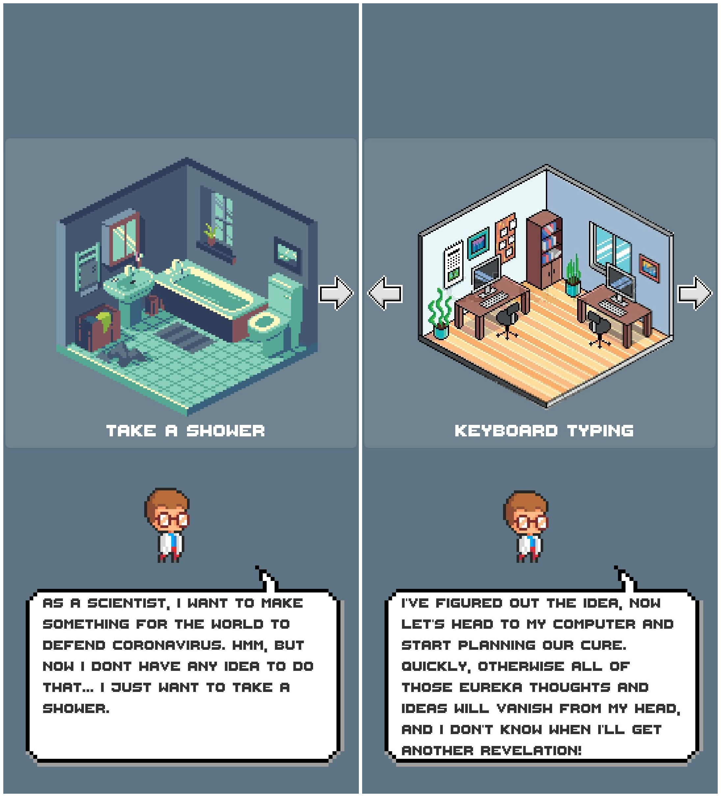
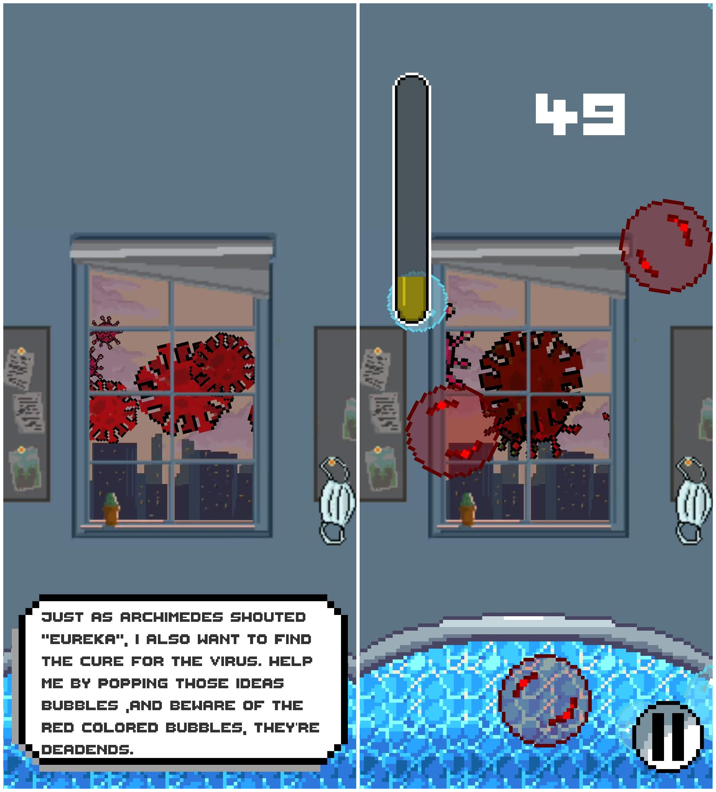
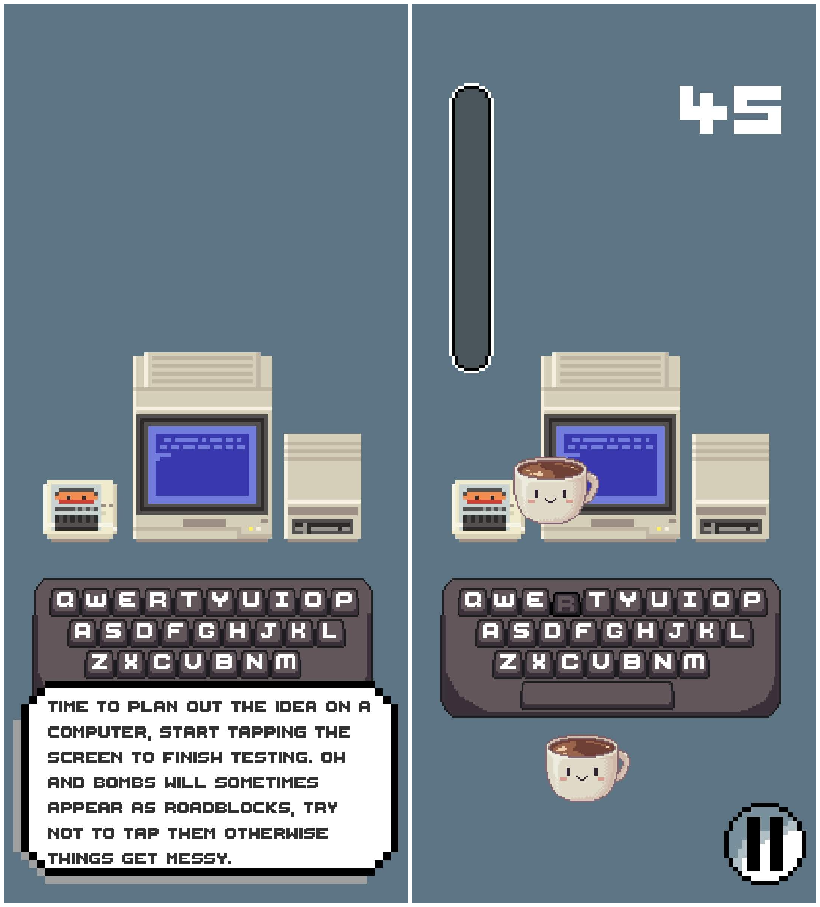
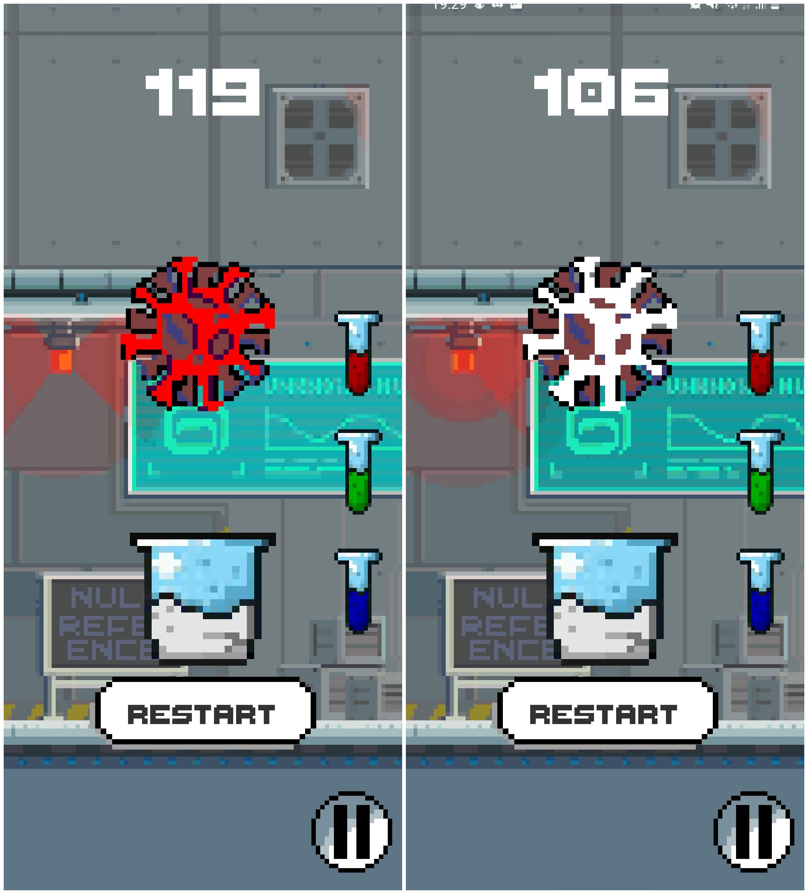
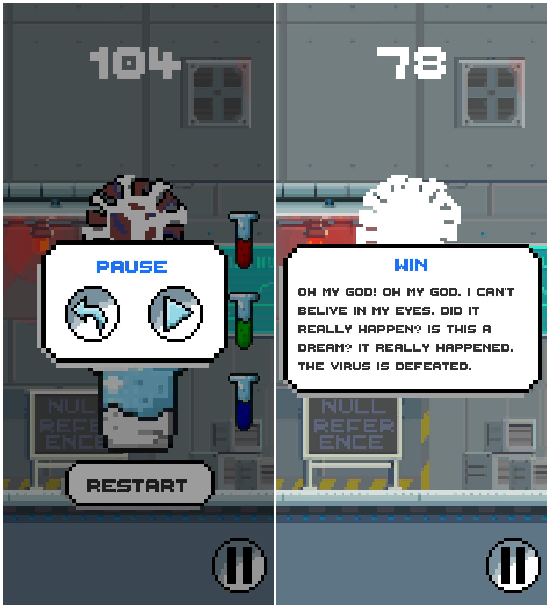

# Null Reference - Scientist at Home

Source code of an Android game made with Unity won the 2nd runner up in the [Gameloft Game Jam 2020](https://gamejam.gameloft.com/) competition, a 48 hours Game Making Challenge.

## Theme
The theme is: **LIFE AT HOME**<br />
Human life is now heavily affected by COVID. Almost all activities in normal life are brought home, such as studying, working, cooking, watching movies, etc. This makes the house that normally has nothing outstanding, now becoming more special than ever.

## About this game

Scientist at Home is an Android game set in the scenario with a worldwide pandemic. You are a scientist who specialised in virus research, and is working in a world famous laboratory. But now because of the pandemic, you are forced work from home.

Your goal is to help the scientist with his day-to-day activities and works, to find the cure for the virus which created all this mess and set the world back to its normal state!

## Screenshots







## Project structure

```
.
├── builds
    └── apk             # Android installation file
└── sources             # Unity sources
    ├── Assets          # multimedia assets
    ├── Packages        # Unity packages
    └── ProjectSettings # specific settings for this project
```

## Sources

All visuals and audios in this game and project are ours or obtained free and with the approved to use from sources over the Internet

## Author
- Null Reference Team:
    - <b>Nguyen Hoang Viet</b>
    - Tran Khanh Tung
    - Do Minh Tam
    - Nguyen Long Vu
- Please contact us at: viet.nguyen.2000@hcmut.edu.vn
