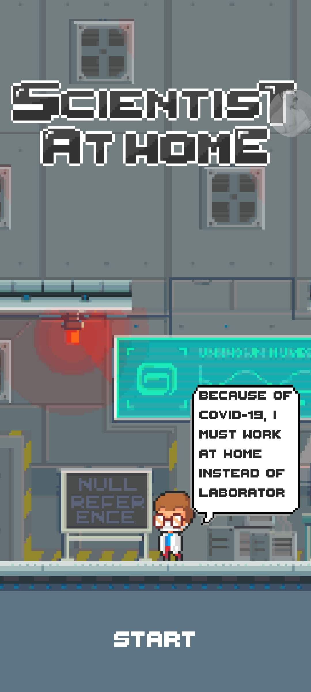
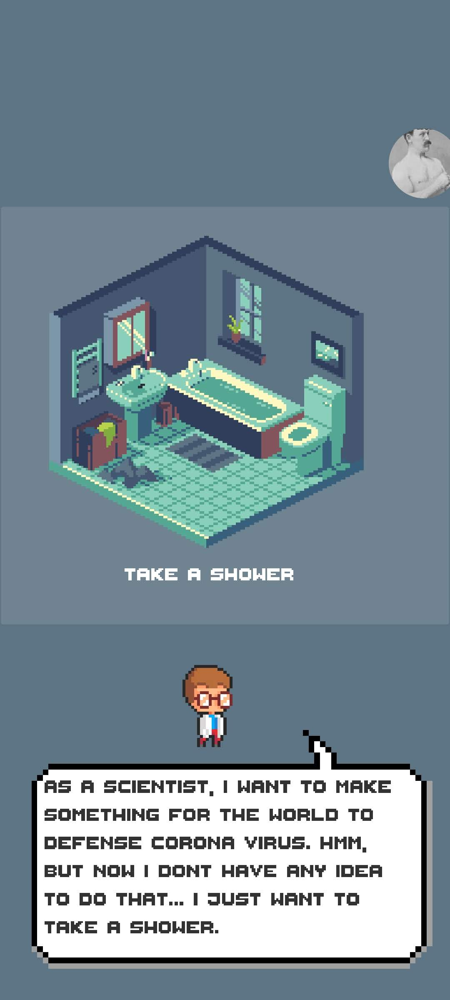

# Null Reference - Scientist at Home

Source code of an Android game made with Unity to compete in [Gameloft Game Jam 2020](https://gamejam.gameloft.com/), a 48 hours Game Making Challenge.

## About this game

Scientist at Home is an Android game set in the scenario with a worldwide pandemic. You are a scientist specialist in virus research, working in a world famous laboratory. But now, because of the pandemic, you are force to stay and work from home.

Your goal is to help the scientist with his day-to-day activities and works, to find the vaccine that cure the virus which created all this mess and set the world back to its normal state!

## Screenshots

 

## Sources

All visuals and audios in this game and project are ours or obtained free and with the approved to use from sources over the Internet

## Author
Null Reference team. Please contact us at: viet.nguyen2000@hcmut.edu.vn
